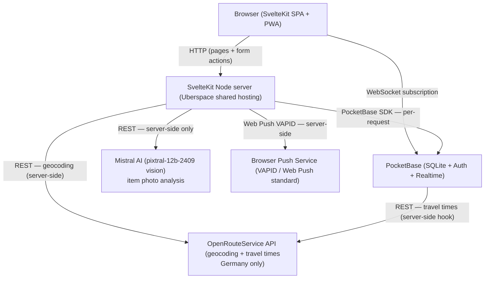

# Architecture

System-level overview of AllerLeih: tech stack, request flow, authentication, routing, AI integrations, external APIs, and deployment. **Start here** for a system-level understanding before reading the domain or data model docs.

---

## Technology Stack

**Key constraint:** All calls to external services (ORS, Mistral, Web Push) are made server-side only. Raw geolocation coordinates and API credentials never reach the browser. User coordinates live in an **owner-only** `user_geolocations` collection (only the owner can read their own row) and are read solely by a PocketBase backend hook (`POST /api/travel-times`) that calls ORS and returns only bucketed minutes — so travel-time ORS calls run from the backend and coordinates never leave it. The browser connects directly to PocketBase only for real-time WebSocket subscriptions — and only with a token passed through `page.data`, since the auth cookie is httpOnly.

---

## Authentication and Authorization

Auth runs as a two-handle sequence in `src/hooks.server.ts` on every request:

1. **`authentication`** — creates a per-request PocketBase instance, restores auth state from the httpOnly cookie, calls `authRefresh()` to extend the session, and sets `event.locals.user` (null if not logged in).

2. **`authorization`** — redirects unauthenticated requests to `/auth/login?redirectTo=<path>` for all routes except the unprotected prefix list:
   - `/auth/*`, `/search`, `/items`, `/users`, `/misc`, `/invite`, `/sitemap.xml`, `/api/redirect`, `/api/diagnostics`

For client-side PocketBase WebSocket subscriptions (live chat), the auth token is passed from the server to the client via `page.data.token`, since the httpOnly cookie is not accessible to browser JS.

---

## Route Overview

| Group | Routes | Auth required |
|---|---|---|
| Auth | `/auth/login`, `/auth/register`, `/auth/reset`, `/auth/logout` | No |
| Core pages | `/search`, `/items/[id]`, `/items/[id]/terms`, `/conversations`, `/conversations/[conversationId]`, `/notifications`, `/social` | Partial (search/items public) |
| User management | `/user/profile`, `/user/items`, `/user/items/bulk-add`, `/user/import`, `/users/[id]`, `/onboarding`, `/invite/[slug]` | Yes (except `/users/[id]`, `/invite/*`) |
| API endpoints | `/api/analyze-item`, `/api/geocode`, `/api/travel-times/search`, `/api/travel-times/item`, `/api/push-subscribe`, `/api/redirect`, `/api/diagnostics` | Varies |
| Static | `/misc/contact`, `/misc/imprint`, `/misc/privacy`, `/misc/tos`, `/misc/guide`, `/sitemap.xml` | No |

All mutations go through SvelteKit **form actions** (`action="?/actionName"`). There is no REST API layer between the frontend and PocketBase — server load functions fetch data, form actions write it.

### PocketBase server hooks (`pb_hooks`)

Some logic runs inside PocketBase itself (JS hooks) so it can use backend privileges without exposing data to the client:

| Hook route | Auth | Purpose |
|---|---|---|
| `GET /api/invite/{code}` | public | Resolves an invite code to `{ id, username }` only, so guests can follow `/invite/<code>` without the public user view exposing every code |
| `POST /api/travel-times` | required | Reads owner coordinates from the owner-only `user_geolocations` collection, calls ORS, and returns only bucketed minutes (coordinates never leave the backend). The SvelteKit `/api/travel-times/{item,search}` endpoints relay to this hook. |

---

## AI Integration

### Current: Mistral Vision — Item Photo Analysis (`/api/analyze-item`)

- **Trigger:** User uploads photos in `/user/items/bulk-add` (bulk import flow for institutions and power users)
- **Model:** `pixtral-12b-2409` (multimodal vision)
- **Input:** Base64-encoded image + MIME type
- **Output:** `{ name: string, description: string, categories: string[] }`
- **Prompt language:** German; instructs the model to name and describe the item, and select up to 3 categories from the fixed `ITEM_CATEGORIES` list in `src/lib/texts.ts`
- **Rate limiting:** In-memory per-user limit of 300 requests/hour — resets on server restart, not safe for multi-instance deployments
- **Data residency:** Mistral processes data in France under EU law; this is disclosed in the bulk upload UI

### Potential Extension Points

- AI-enhanced search (e.g. user asks "What do I need to drill build a treehouse?" and AI suggests relevant items)
- Auto-categorisation during single-item upload (currently bulk-only)
- CSV import quality checks and enrichment for institutional partners
- ...

---

## External API Boundaries

| Service | Direction | Purpose | Notes |
|---|---|---|---|
| OpenRouteService (ORS) | Server → ORS | Address autocomplete (`/api/geocode`) | Restricted to Germany (`boundary.country=DEU`) |
| OpenRouteService (ORS) | PocketBase hook → ORS | Travel time matrix (`POST /api/travel-times` hook) | Supports foot, bicycle, car; reads coords from owner-only `user_geolocations`, returns only bucketed minutes; SvelteKit `/api/travel-times/{item,search}` relay to it |
| Mistral AI | Server → Mistral | Item photo analysis (`/api/analyze-item`) | pixtral-12b-2409 vision model; server-side only |
| Web Push (VAPID) | Server → Push service | Push notifications | Per-device subscriptions stored in `push_subscriptions`; stale subscriptions auto-removed on HTTP 410/404 |

---

## Deployment Pipeline

- **Platform:** Uberspace shared hosting (Linux, Node.js, supervisord)
- **Deploy trigger:** push to `main` → GitHub Actions (`.github/workflows/deploy-to-uberspace.yaml`) → `npm ci && npm run build` → `rsync` to Uberspace
- **Process restart:** `supervisorctl restart svelte`
- **Build-time secrets injected:** `PUBLIC_PB_URL`, `ORS_API_KEY`, `MISTRAL_API_KEY`, VAPID keys (`PUBLIC_VAPID_PUBLIC_KEY`, `VAPID_PRIVATE_KEY`, `VAPID_SUBJECT`), `LOGIN_SECRET`
- **Body size limit:** 10 MB, set via `BODY_SIZE_LIMIT` env var on the server after each deploy
- **PocketBase:** runs as a separate process on Uberspace (repo `allerleih-backend`; schema + JS hooks version-controlled, migrations auto-applied on start); SQLite data and file uploads live on the server filesystem — not managed by the SvelteKit CI/CD pipeline. ⚠️ The backend now requires **`ORS_API_KEY`** in **its own** environment (used by the `/api/travel-times` hook) — not only in the SvelteKit build.

**CI on pull requests:** Vitest runs with coverage (json + lcov) on every PR to `main` via `.github/workflows/vitest.yaml`. Coverage is posted as a PR comment via `davelosert/vitest-coverage-report-action`. The build step also catches TypeScript and Svelte compilation errors before merging.

---

## Real-time Architecture

AllerLeih uses PocketBase's built-in WebSocket subscriptions for live chat in the conversations view. The utility function `setupPocketBaseSubscription()` in `src/lib/utils/utils.ts` wraps this pattern:

- Takes a collection name, optional record ID (`'*'` to subscribe to all records), and a callback
- Returns an unsubscribe function suitable for `$effect()` cleanup in Svelte 5
- Auth token is synced server-to-client via `page.data.token` so the client-side PocketBase instance can authenticate the WebSocket connection (the httpOnly cookie is inaccessible to JS)

Push notifications (for events that happen when the user is not on the site) use the Web Push standard via the `web-push` npm package — these are one-way server → browser messages, not WebSocket connections.
