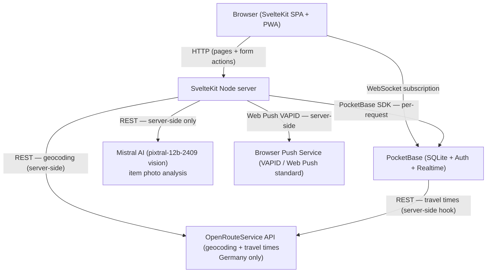

# Architecture

System-level overview of AllerLeih: tech stack, request flow, authentication, routing, AI integrations, external APIs, and deployment. **Start here** for a system-level understanding before reading the domain or data model docs.

---

## Technology Stack

```mermaid
graph TD
    Browser["Browser (SvelteKit SPA + PWA)"]
    SK["SvelteKit Node server"]
    PB["PocketBase (SQLite + Auth + Realtime)"]
    ORS["OpenRouteService API (geocoding + travel times\nGermany only)"]
    Mistral["Mistral AI (pixtral-12b-2409 vision)\nitem photo analysis"]
    Push["Browser Push Service (VAPID / Web Push standard)"]

    Browser -->|"HTTP (pages + form actions)"| SK
    Browser -->|"WebSocket subscription"| PB
    SK -->|"PocketBase SDK — per-request"| PB
    SK -->|"REST — geocoding (server-side)"| ORS
    PB -->|"REST — travel times (server-side hook)"| ORS
    SK -->|"REST — server-side only"| Mistral
    SK -->|"Web Push VAPID — server-side"| Push
```

**Key constraint:** All calls to external services (ORS, Mistral, Web Push) are made server-side only. Raw geolocation coordinates and API credentials never reach the browser. User coordinates live in an **owner-only** `user_geolocations` collection (only the owner can read their own row) and are read solely by a PocketBase backend hook (`POST /api/travel-times`) that calls ORS and returns only bucketed minutes — so travel-time ORS calls run from the backend and coordinates never leave it. The browser connects directly to PocketBase only for real-time WebSocket subscriptions — and only with a token passed through `page.data`, since the auth cookie is httpOnly.

---

## Authentication and Authorization

Auth runs as a two-handle sequence in `src/hooks.server.ts` on every request:

1. **`authentication`** — creates a per-request PocketBase instance, restores auth state from the httpOnly cookie, calls `authRefresh()` to extend the session, and sets `event.locals.user` (null if not logged in).

2. **`authorization`** — redirects unauthenticated requests to `/auth/login?redirectTo=<path>` for all routes except the unprotected prefix list as defined in `hooks.server.ts`.

For client-side PocketBase WebSocket subscriptions (live chat), the auth token is passed from the server to the client via `page.data.token`, since the httpOnly cookie is not accessible to browser JS.

---

## Route Overview

| Group | Routes | Auth required |
|---|---|---|
| Auth | `/auth/login`, `/auth/register`, `/auth/reset`, `/auth/reset/confirm`, `/auth/confirm-verification`, `/auth/confirm-email-change`, `/auth/logout` | No |
| Core pages | `/search`, `/items/[id]`, `/items/[id]/terms`, `/conversations`, `/conversations/[conversationId]`, `/notifications`, `/social` | Partial (search/items public) |
| User management | `/user/profile`, `/user/items`, `/user/items/bulk-add`, `/user/import`, `/users/[id]`, `/onboarding`, `/invite/[slug]` | Yes (except `/users/[id]`, `/invite/*`) |
| API endpoints | `/api/analyze-item`, `/api/geocode`, `/api/travel-times/search`, `/api/travel-times/item`, `/api/push-subscribe`, `/api/redirect`, `/api/diagnostics` | Varies |
| Static / info | `/misc/contact`, `/misc/imprint`, `/misc/privacy`, `/misc/tos`, `/misc/guide`, `/misc/stats`, `/sitemap.xml`, `/robots.txt` | No |
| Legal consent | `/legal/accept`, `/legal/locked` | Yes (gate-exempt) |
| Business metrics | `/admin/metrics` (`users.isAdmin` only, 404 otherwise), `/misc/stats` (public headline numbers, also teased on the home page) | `/admin/metrics`: yes + admin flag; `/misc/stats`/`/`: no |

`/misc/tos` and `/misc/privacy` are public but no longer static — they render the active document from the `legal_documents` collection (Issue #399). `/legal/accept` and `/legal/locked` are the re-consent gate (see [domain-model.md](domain-model.md)); they are exempt from the gate itself so a not-yet-consented user can reach them.

`/admin/metrics` and `/misc/stats` read the nightly `metrics_daily` snapshot (computed in the
`allerleih-backend` repo) plus cheap live counts — see [operations/metrics.md](operations/metrics.md).

All mutations go through SvelteKit **form actions** (`action="?/actionName"`). There is no REST API layer between the frontend and PocketBase — server load functions fetch data, form actions write it.

### PocketBase server hooks (`pb_hooks`)

Some logic runs inside PocketBase itself (JS hooks) so it can use backend privileges without exposing data to the client:

| Hook route | Auth | Purpose |
|---|---|---|
| `GET /api/invite/{code}` | public | Resolves an invite code to `{ id, username }` only, so guests can follow `/invite/<code>` without the public user view exposing every code |
| `POST /api/travel-times` | required | Reads owner coordinates from the owner-only `user_geolocations` collection, calls ORS, and returns only bucketed minutes (coordinates never leave the backend). The SvelteKit `/api/travel-times/{item,search}` endpoints relay to this hook. |
| `GET /api/contact/{userId}` | required | Returns a user's telegram/signal handles for the caller, honouring the per-handle "visible to trusted only" flags + trust at the data layer (handles live in the owner-only `user_contacts` collection). |
| `POST /api/legal/accept` · `POST /api/legal/decline` | required | Platform legal consent (#399). Server-authoritative: snapshot the active `legal_documents` body, write the immutable `user_legal_acceptances` record, refresh the user's version cache, and set/clear `legalLocked` — all in a transaction, in superuser context (the user can't write any of this directly). A `legalLocked` user is additionally blocked from mutating data at the PocketBase layer. |

---

## AI Integration

### Mistral Vision — Item Photo Analysis (`/api/analyze-item`)

- **Trigger:** User uploads photos in `/user/items/bulk-add` (bulk import flow for institutions and power users)
- **Model:** `pixtral-12b-2409` (multimodal vision)
- **Input:** Base64-encoded image + MIME type
- **Output:** `{ name: string, description: string, categories: string[] }`
- **Prompt language:** German; instructs the model to name and describe the item, and select up to 3 categories from the fixed `ITEM_CATEGORIES` list in `src/lib/categories.ts`
- **Rate limiting:** In-memory per-user limit of 300 requests/hour — resets on server restart, not safe for multi-instance deployments
- **Data residency:** Mistral processes data in France under EU law; this is disclosed in the bulk upload UI

## External API Boundaries

| Service | Direction | Purpose | Notes |
|---|---|---|---|
| OpenRouteService (ORS) | Server → ORS | Address autocomplete (`/api/geocode`) | Restricted to Germany (`boundary.country=DEU`) |
| OpenRouteService (ORS) | PocketBase hook → ORS | Travel time matrix (`POST /api/travel-times` hook) | Supports foot, bicycle, car; reads coords from owner-only `user_geolocations`, returns only bucketed minutes; SvelteKit `/api/travel-times/{item,search}` relay to it |
| Mistral AI | Server → Mistral | Item photo analysis (`/api/analyze-item`) | pixtral-12b-2409 vision model; server-side only |
| Web Push (VAPID) | Server → Push service | Push notifications | Per-device subscriptions stored in `push_subscriptions`; stale subscriptions auto-removed on HTTP 410/404 |
| partner lending software instances | Backend (PocketBase hooks) → partner software | Sync partner item catalogues into `items` | Polled by the backend `integration_sync` / `integration_refresh` cron jobs; each institution's `sync_config` row is read and items owned by that account are upserted/archived. See [integrations.md](integrations.md) for details |

## Instance configuration (multi-city)

**`src/lib/instance.ts` is the single source of everything that differs between AllerLeih
instances** (city, origin, contact addresses, imprint, social/project links, analytics) — routes
and components read from it instead of hardcoding `allerleih.org` or a city name. Flagship-only
literal defaults (allerleih.org's own operator data) live in `src/lib/instanceDefaults.ts`.
`src/lib/texts.ts` imports `instance` and interpolates the German copy at module load (e.g.
`pages.landing.whoBodyPart1`, the PWA install steps); everything else in the app reads
URLs/emails straight from `instance`.

**The flagship instance** is allerleih.org itself (`isFlagshipOrigin()` in `instanceResolvers.ts`
decides this from the *resolved* origin, not the raw env var — unset counts as flagship, since
production doesn't set `PUBLIC_SITE_ORIGIN` at all). Every instance-branding var falls into one of
three classes:

| Class | Meaning | Vars |
|---|---|---|
| **A** | Required on a non-flagship instance — the server refuses to start without it (`missingInstanceEnv()` in `src/lib/server/env.ts`); a §5 TMG imprint is legally mandatory | `PUBLIC_INSTANCE_CITY`, `PUBLIC_CONTACT_EMAIL`, `PUBLIC_IMPRINT_OPERATOR`, `PUBLIC_IMPRINT_STREET`, `PUBLIC_IMPRINT_POSTAL_CODE`, `PUBLIC_IMPRINT_CITY`, `PUBLIC_IMPRINT_COUNTRY` |
| **B** | Optional on every instance — unset ⇒ `''` on a non-flagship instance, and the render site hides the link/field (no dead link) | `PUBLIC_IMPRINT_REPRESENTATIVE`, `PUBLIC_IMPRINT_REGISTER_ENTRY`, `PUBLIC_FEEDBACK_EMAIL`, `PUBLIC_SOCIAL_TELEGRAM`, `PUBLIC_SOCIAL_MASTODON`, `PUBLIC_SOCIAL_PIXELFED`, `PUBLIC_SOCIAL_INSTAGRAM`, `PUBLIC_CONTRIBUTE_URL` |
| **C** | Defaults unconditionally, not flagship-gated | `PUBLIC_GITHUB_URL` (upstream repo) |

Plus the two cosmetic/analytics vars that predate the class system and are optional everywhere:
`PUBLIC_APP_NAME` (default `AllerLeih`) and the opt-in analytics pair `PUBLIC_ANALYTICS_ORIGIN`/
`PUBLIC_ANALYTICS_WEBSITE_ID` (unset ⇒ off). `PUBLIC_SITE_ORIGIN` itself defaults to
`https://allerleih.org` when unset or invalid — never throws (a bad env var must not 500 the
whole app) — but on a non-flagship instance a value that fails to parse as a valid http(s) origin
is *also* reported as missing by `missingInstanceEnv()`, alongside whichever Class A vars are
unset, rather than silently masquerading as the flagship (issue #646).

In `dev`, a misconfigured non-flagship instance only logs a `console.warn` instead of refusing to
start (`src/hooks.server.ts`'s `init` hook) — production always gets the hard failure.

**The origin rule** — stated once, applied everywhere: crawler-facing absolute URLs (sitemap,
robots, `canonical` via `SeoHead`'s opt-in `canonical` flag, `og:url`, `og:image`) always come
from `instance.origin` / `instanceUrl()`, called with a **literal root-absolute path** (or, for
canonical/`og:url`, the current page's own `page.url.pathname` from `$app/state` — never a
passed-in path). User-facing share/invite links keep `url.origin`, because a copied link must
work on the host the user is actually on (LAN dev, preview, custom domain) — switching those to
the configured origin would make dev/preview share links point at production.

**Never write `instanceUrl(resolve(...))`.** `svelte.config.js` has no `paths` block, so
SvelteKit's default `paths.relative: true` applies, and `resolve()` (`$app/paths`) returns a
**page-relative** path during server-side rendering (e.g. `'./'` for `/`, `'../misc/imprint'`
for a nested route) — not the root-absolute path `instanceUrl()` expects. Concatenating the two
produced malformed `canonical`/`og:url` tags in the raw server-rendered HTML
(`https://allerleih.org../misc/imprint`) that looked correct in a browser only because the
client recomputes a right-looking value after hydration (issue #473, caught only by an e2e test
reading the raw SSR response — see `e2e/tests/seo-canonical.spec.ts`). `instanceUrl()` logs a
DEV-only console error if given a non-root-absolute path, to make a repeat loud instead of silent.

**`$env/dynamic/*` is the repo-wide convention** (issue #627): every env access — public and
private — is read at **runtime**, and `$env/static/*` is banned by ESLint. The reason is the one
this file already gave for `instance.ts`: one build artefact must serve N city instances, and
`adapter-node` reads environment variables from `process.env` at **server start**, not at build
time; `$env/static/*` would bake a single instance's values into the bundle, requiring one build
per city. What differs is only the *scope* of each module: `$lib/instance.ts` is the source for
**instance/branding** values (city, origin, contact, analytics), `$lib/publicEnv.ts` for the two
public **plumbing** vars (`pbUrl()` → `PUBLIC_PB_URL`, `vapidPublicKey()` →
`PUBLIC_VAPID_PUBLIC_KEY`), and each private var is read with `{ env } from
'$env/dynamic/private'` in the single module that needs it. Which vars must exist at startup is
declared in `$lib/server/env.ts` and enforced by the `init` server hook (see "Runtime env vars"
below). `$lib/instance.ts`, `$lib/publicEnv.ts` — and therefore `$lib/texts.ts` — must never be
imported from `src/service-worker.ts`: `$env/dynamic/public` is a hard error there (no request
context), which `eslint.config.js` now enforces for that file.

**Consequence for every `PUBLIC_*` var:** `$env/dynamic/public` serialises the **entire**
`PUBLIC_*` env into every rendered page (SvelteKit ships the whole dynamic-public object to the
client so it can hydrate) — unlike the tree-shaken `$env/static/public` this repo no longer uses.
Since `$lib/instance.ts` and `$lib/publicEnv.ts` are both transitively reachable from the client
bundle, that whole-object broadcast applies repo-wide. Harmless today because only already-public
vars exist, but treat any new `PUBLIC_*` var as fully public from the moment it is set in the
server env — it is shipped to every visitor whether or not any module reads it. Never put a secret
behind the `PUBLIC_` prefix.

**Branding is only partially instance-configurable.** `PUBLIC_APP_NAME` overrides `texts.names.app`
(used in `<title>`s, meta tags, a handful of UI strings), but it does **not** rewrite the ~89
literal "AllerLeih" occurrences baked into the German copy in `src/lib/texts.ts`, nor the image
assets (logo, favicon, PWA icons). Per-instance visuals are handled **outside** this config, by two
separate, unrelated mechanisms:
- **Colours** re-skin via the `[data-theme]` CSS override described in
  [design-system.md](design-system.md) → "White-Labeling".
- **Binary assets** (logo, icons, `static/manifest.webmanifest`) are swapped **statically**, under
  unchanged filenames, via a per-instance rsync overlay applied on top of `build/client/` at deploy
  time — `static/manifest.webmanifest` stays a plain static file (not an SSR route) for this
  reason, since it lives in the same per-instance asset overlay as the icons it references.

**Deploy note:** analytics is opt-in with no fallback instance, so omitting the two vars silently
stops Umami tracking rather than falling back to a default. Production therefore has to supply
`PUBLIC_ANALYTICS_ORIGIN=https://analytics.allerleih.org` and
`PUBLIC_ANALYTICS_WEBSITE_ID=6cfb6acd-259e-4771-baa7-c677387ea292` in its **runtime** environment —
see "Current Deployment Pipeline" below for where that has to live and which three traps to avoid.

## Current Deployment Pipeline for "AllerLeih" (proof-of-concept instance)

- **Platform:** Uberspace shared hosting (Linux, Node.js, supervisord)
- **Deploy trigger:** push to `main` → GitHub Actions (`.github/workflows/deploy-to-uberspace.yaml`) → `npm ci && npm run build` → `rsync` to Uberspace
- **Process restart:** `supervisorctl restart svelte`
- **Build-time secrets injected: none.** As of issue #627 the build takes **no** environment at
  all — `npm run build` produces a generic, instance-agnostic artefact, and a value passed to the
  build step would silently do nothing. All seven required vars are **runtime** vars, written by
  the deploy's SSH step into a `.env` next to `build/`: `PUBLIC_PB_URL`,
  `PUBLIC_VAPID_PUBLIC_KEY`, `VAPID_PRIVATE_KEY`, `VAPID_SUBJECT`, `ORS_API_KEY`,
  `PB_SUPERUSER_EMAIL`, `PB_SUPERUSER_PASSWORD` (plus the optional `MISTRAL_API_KEY`, the
  optional `PUBLIC_*` instance vars, and the adapter's `BODY_SIZE_LIMIT`). That `.env` is written
  with a truncating `>`, so **every** runtime var must be listed in the workflow — anything
  hand-added on the server is discarded on the next deploy. The contract is enforced in-app: the
  `init` hook in `src/hooks.server.ts` calls `assertRequiredEnv()` (`$lib/server/env.ts`) before
  the server listens, so a missing or empty required var makes the process exit non-zero with
  every offender named, instead of leaving a half-working site up. The check is presence-only — it
  proves a non-empty line exists, not that the value is usable (a placeholder `ORS_API_KEY`
  satisfies it). `logOptionalEnvGaps()` then prints one `console.info` line naming the vars from
  `OPTIONAL_ENV` this instance runs without and what that disables (names only, never values), so a
  quietly-off feature shows up in the startup log instead of surfacing later as a 503.
  (Integration sync/refresh + the CSV write path run entirely in the backend as of #487 Phase 3 —
  no frontend sync secret.
  `PB_SUPERUSER_*` are **not** tooling-only: `$lib/server/superuser.ts` → `$lib/server/metrics.ts`
  → the root `+layout.server.ts`'s `isAdmin()` call reads them on every authenticated request, and
  they also back the public stats on `/` and `/misc/stats`.)
- **Body size limit:** 10 MB, set via `BODY_SIZE_LIMIT` env var on the server after each deploy
- **PocketBase:** runs as a separate process on Uberspace (repo `allerleih-backend`; schema + JS hooks version-controlled, migrations auto-applied on start); SQLite data and file uploads live on the server filesystem — not managed by the SvelteKit CI/CD pipeline. ⚠️ The backend requires **`ORS_API_KEY`** in **its own** environment (used by the `/api/travel-times` hook) — a separate value from the frontend's, which lives in the SvelteKit runtime `.env`.
- **Runtime env vars** — since #627 that is *all* of them (the seven required ones,
  `MISTRAL_API_KEY`, and the instance-branding vars — see "Instance configuration" above for the
  Class A/B/C breakdown). This deploy IS the flagship instance (`PUBLIC_SITE_ORIGIN` is one of the
  two repo Variables the `.env` block in `deploy-to-uberspace.yaml` leaves unset), so none of the
  Class A/B vars need setting here; a deploy pointed at any other origin would need the seven
  Class A vars too, or the process refuses to start. They are read via `$env/dynamic/*` from `process.env`
  (adapter-node) at server start, never baked into the build — so one build artefact serves every
  city instance and only each instance's runtime environment differs. Three traps when adding one:
  (1) putting it in the workflow's `npm run build` step has **no** effect — that is now true for
  *every* var, not just the instance ones, and it is the single most likely mistake; (2) the
  deploy's SSH step writes the whole `.env` with a truncating `>`, so anything hand-added to that
  file on the server is discarded on the next deploy — add the var to that block in
  `deploy-to-uberspace.yaml` (public instance values are GitHub Actions *variables*, secrets are
  *secrets*); (3) the `svelte` supervisord service has no `environment=` line, so `.env` +
  `node -r dotenv/config build` is the **only** bridge into `process.env` — which means `dotenv`
  must stay in `dependencies` (`dotenv@^17.2.3`, `package.json`), never move it to
  `devDependencies`. See "Instance configuration" above.

**CI on pull requests:** Vitest runs with coverage (json + lcov) on every PR to `main` via `.github/workflows/vitest.yaml`. Coverage is posted as a PR comment via `davelosert/vitest-coverage-report-action`. The build step also catches TypeScript and Svelte compilation errors before merging.

## Running the official container image

An official multi-stage image (`Dockerfile`, repo root) is built by
`.github/workflows/docker-publish.yaml` and published to GHCR as
`ghcr.io/share-open-sharing-infrastructure/allerleih-frontend` — the explicit name rather than
`ghcr.io/${{ github.repository }}` (which would resolve to `.../share-mvp`), symmetric to the
backend's own image (allerleih-backend#55). The build stage runs `npm ci && npm run build` on
`node:<version>-alpine`; the runtime stage copies only `build/`, `package.json` and
`package-lock.json`, runs `npm ci --omit=dev` as the non-root `node` user, and strips `*.map`
files before shipping. As with the Uberspace deploy, the build stage takes **no** application env
(#627) — the resulting image is instance-agnostic, and this is an **additional** distribution
channel, not a replacement for the Uberspace pipeline above.

Every runtime var from "Instance configuration" and the required-env table above applies
unchanged. Pass them as **process environment** — `docker run --env-file`/`-e`, compose
`env_file:`, or your orchestrator's secret store. Note the difference to the Uberspace channel:
that service runs `node -r dotenv/config build` and therefore reads a `.env` file next to
`build/`, whereas the image's entrypoint is plain `node build`, so **a `.env` mounted into the
container is ignored** and the app refuses to start as if nothing were configured. This table is
the **single canonical, fully-detailed reference** — README.md only summarizes it and links back
here:

| Variable | Needed for | Default |
|---|---|---|
| `PUBLIC_PB_URL` | PocketBase base URL every request talks to | — (required) |
| `PUBLIC_VAPID_PUBLIC_KEY` | Web-Push VAPID public key | — (required) |
| `VAPID_PRIVATE_KEY` | Web-Push VAPID private key | — (required) |
| `VAPID_SUBJECT` | Web-Push VAPID subject (`mailto:`/`https:` URL) | — (required) |
| `ORS_API_KEY` | Address autocomplete (`/api/geocode`) | — (required) |
| `PB_SUPERUSER_EMAIL` / `PB_SUPERUSER_PASSWORD` | **Full PocketBase superuser credentials** — unrestricted read/write on every collection (all users' emails, coordinates, trust graph, messages) plus schema and admin control, bypassing every collection rule. This app only *uses* them for the `/admin` gate, public stats, and `metrics_daily`, but the credential itself is not scoped to those three features — store and rotate it like any other master secret, not like a feature-scoped API key. | — (required) |
| `MISTRAL_API_KEY` | AI item-photo analysis | unset ⇒ `/api/analyze-item` answers 503 |
| `PUBLIC_SITE_ORIGIN`, `PUBLIC_INSTANCE_CITY`, `PUBLIC_CONTACT_EMAIL`, `PUBLIC_IMPRINT_OPERATOR`, `PUBLIC_IMPRINT_STREET`, `PUBLIC_IMPRINT_POSTAL_CODE`, `PUBLIC_IMPRINT_CITY`, `PUBLIC_IMPRINT_COUNTRY` | Instance branding, Class A | required unless this is the flagship instance — see "Instance configuration" above |
| `PUBLIC_IMPRINT_REPRESENTATIVE`, `PUBLIC_IMPRINT_REGISTER_ENTRY`, `PUBLIC_FEEDBACK_EMAIL`, `PUBLIC_SOCIAL_TELEGRAM`, `PUBLIC_SOCIAL_MASTODON`, `PUBLIC_SOCIAL_PIXELFED`, `PUBLIC_SOCIAL_INSTAGRAM`, `PUBLIC_CONTRIBUTE_URL`, `PUBLIC_GITHUB_URL`, `PUBLIC_APP_NAME`, `PUBLIC_ANALYTICS_ORIGIN`, `PUBLIC_ANALYTICS_WEBSITE_ID` | Instance branding, Class B/C + cosmetic/analytics | optional everywhere — see "Instance configuration" above |

Two adapter-node knobs are **not** in that set and cannot be, because `assertRequiredEnv()` has
no way to see them — they are validated by adapter-node itself, not by this app:

- **`BODY_SIZE_LIMIT`** — the image sets this to `10485760` (10 MB) by default, for parity with
  the Uberspace deploy's bulk image-upload limit. This is the **only** effective knob: the
  `bodySize` option passed to `adapter()` in `svelte.config.js` is **not** a real adapter-node
  option (only `out`/`precompress`/`envPrefix` are) and is a silent no-op — don't be misled by it
  into thinking the limit is configured there.
- **`ORIGIN=https://app.example.org`** — required in essentially **every** deployment, not only
  behind a reverse proxy, and the single most common self-hosting failure. adapter-node's
  `get_origin()` takes the expected origin from `ORIGIN`, or else builds it from the request's
  `Host` header plus a protocol that **defaults to `https`** whenever `PROTOCOL_HEADER` is unset
  (`@sveltejs/adapter-node/files/handler.js`). A container reached directly over plain HTTP with no
  proxy at all therefore derives `https://<host>`, never matches the browser's `Origin:
  http://<host>`, and rejects every POST form action with "Cross-site POST form submissions are
  forbidden" — verified empirically against this image, including `http://127.0.0.1:3000`. Set it
  to the exact scheme, host and port users reach the app on. Alternative behind a proxy that sets
  them: `PROTOCOL_HEADER=x-forwarded-proto` + `HOST_HEADER=x-forwarded-host`.
- **`ADDRESS_HEADER`** / **`XFF_DEPTH`** — set these so the app sees the real client IP rather
  than the proxy's.
- **Only set `ADDRESS_HEADER`, `PROTOCOL_HEADER` or `HOST_HEADER` if the reverse proxy is
  configured to *overwrite* that header on every request — never if it merely passes a
  client-supplied one through.** adapter-node trusts these header values verbatim
  (`node_modules/@sveltejs/adapter-node/files/handler.js`) to derive the client IP and the
  CSRF-relevant request origin. A proxy that forwards an incoming `X-Forwarded-For`/`-Proto`/
  `-Host` instead of setting its own lets a client spoof those headers directly at the app,
  defeating the very origin check `PROTOCOL_HEADER`+`HOST_HEADER` exists to provide.

A `docker compose` setup that wires this image together with a PocketBase container lives in
[`deploy/`](../deploy) — see
[docs/operations/self-hosting.md](operations/self-hosting.md) for the stack plus the first-run
runbook (share-mvp#630); this section covers the frontend image alone.

## Real-time Architecture

AllerLeih uses PocketBase's built-in realtime (SSE) subscriptions for live chat in the conversations view. The single entry point `subscribeRealtime()` in `src/lib/client-pb.ts` wraps this pattern:

- Takes an options object: collection, optional topic/record ID (`'*'` for all records), a handler, and an optional `onReconnect` callback
- Adds retry-on-connect-failure and automatic recovery after a network drop or a mobile tab background-freeze (which silently kills the stream) — `onReconnect` fires so callers can refetch state missed while the stream was down (issue #435)
- Returns an unsubscribe function suitable for `$effect()` cleanup in Svelte 5
- Auth token is synced server-to-client via `page.data.token` so the client-side PocketBase instance can authenticate the connection (the httpOnly cookie is inaccessible to JS)

Domain-specific reconciliation lives next to its route in rune-free helper modules rather than in the components themselves:

- `src/routes/conversations/conversationListRealtime.ts` — keeps the conversation sidebar list in sync: `update` events sync `readByOwner`/`readByRequester`/`lastMessageAt`/`lendingStatus` and re-sort (mirroring the server's `-lastMessageAt,-updated` sort), `create` events insert the fetched record at its sorted position, `delete` events remove the entry.
- `src/routes/conversations/[conversationId]/conversationRealtime.ts` — keeps a single open conversation in sync (lending status, counterfactual, and the fetch/dedupe of every newly appended message id in a coalesced/batched event, not just the last one). State is read/written through accessor closures so the page keeps ownership of the reactive state.

Pages hold "server-load data that a realtime handler also writes to" in a `realtimeSynced()` box (`src/lib/stores/realtimeSynced.svelte.ts`) — a writable `$derived` that re-syncs from `load()` while staying directly assignable by the handler (issue #469).

### Conversations: server-helper layout

The `/conversations` area's server logic is split by ownership, following the "libs never import from routes" rule:

- `src/lib/server/conversations.ts` — `deleteConversation()`, shared by the route's `?/deleteConversation` action and `$lib/server/items.ts`'s cascade-on-item-delete (an item's conversations are deleted with it).
- `src/lib/server/items.ts` — `toggleItemStatus()` (flips an item's availability from the conversation header) alongside the existing `setItemStatus`/`deleteItem`/`deleteMultipleItems`.
- `src/lib/server/notifications.ts` — `notifyAndPush()` bundles the create-notification + send-push pair every call site needs; `sendMessage` (route-local `conversation.server.ts`) and the 6 lending transitions (`[conversationId]/lending.server.ts`) both call it.
- `[conversationId]/lending.server.ts` — the 6 `?/actionName` transitions are table-driven: `$lib/lending.ts`'s `LENDING_TRANSITIONS` supplies the role/from/to per action, and a local `TRANSITION_EFFECTS` table supplies the per-action item/notification side effects, both consumed by a single `executeLendingTransition()`.
- `[conversationId]/conversationDetail.ts` — `toConversationDetail()` maps the raw `conversations` wire record (ids + optional `expand`) to the flattened, dangling-item-safe view-model the detail page and its header render from.

Push notifications (for events that happen when the user is not on the site) use the Web Push standard via the `web-push` npm package — these are one-way server → browser messages, not WebSocket connections.
