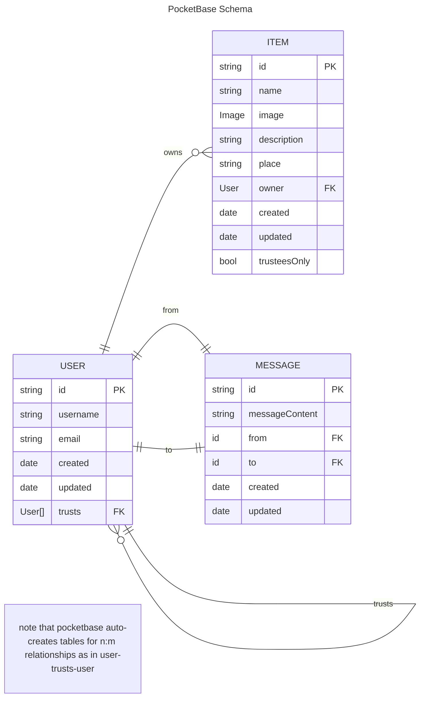

# Data Model

Here live the ER schemas as (should be) implemented in the database version of the current branch.

# Main Schema

```mermaid
---
title: PocketBase Schema
---
erDiagram
    direction LR
    USER{
        string id PK
        string username
        string email
        date created
        date updated
        User[] trusts FK
    }
    USER 1 to zero or more USER: "trusts"
    "note that pocketbase auto-creates tables for n:m relationships as in user-trusts-user"

    ITEM{
        string id PK
        string name
        Image image
        string description
        string place
        User owner FK
        date created
        date updated
        bool trusteesOnly
    }

    USER 1 to zero or more ITEM: owns

    MESSAGE{
        string id PK
        string messageContent
        id from FK
        id to FK
        date created
        date updated
    }

    USER 1 to 1 MESSAGE: "from"
    USER 1 to 1 MESSAGE: "to"

```
