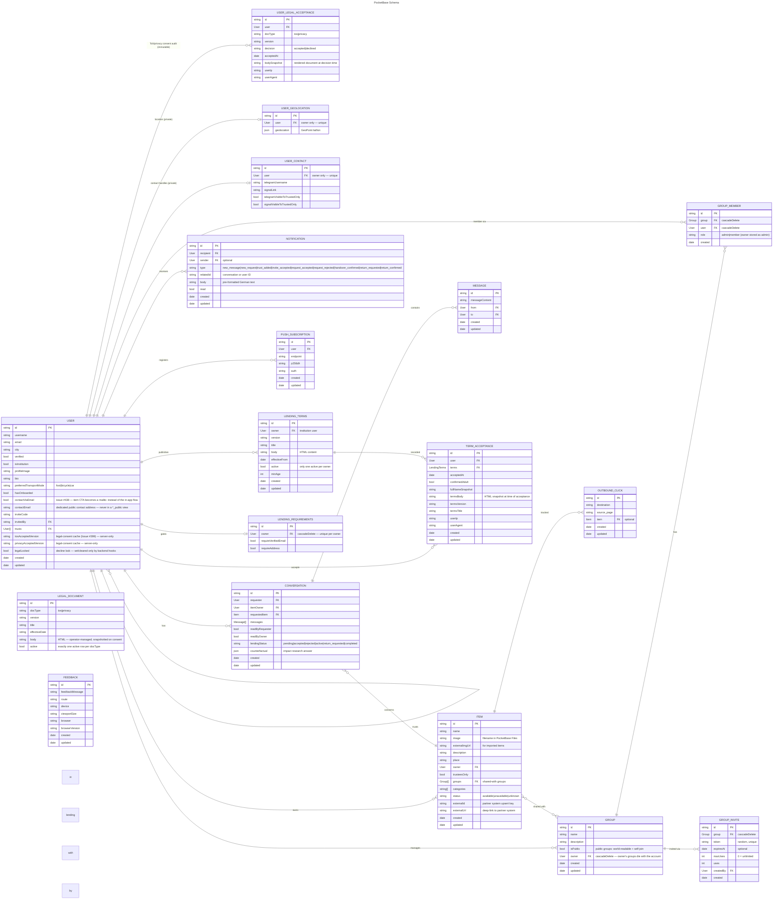

# Data Model

Here live the ER schemas as implemented in the database for the current branch.

# Main Schema

## user_geolocations

Coordinates are **not** stored on `users` — they live in a separate `user_geolocations` collection so they can be locked to the owner. All API rules (`listRule`/`viewRule`/`createRule`/`updateRule`/`deleteRule`) are `@request.auth.id = user`, so a user can only ever read/write **their own** row; no account can query another user's coordinates. The `users` collection no longer has a `geolocation` field at all. Travel-time computation reads coordinates with backend privileges via the `/api/travel-times` hook (see below).

## user_contacts

Messenger handles (`telegramUsername`, `signalLink`) and their per-handle "visible to trusted only" flags live here, **not** on `users`. All API rules are `@request.auth.id = user` (owner-only). They reach other users only through the `GET /api/contact/{userId}` hook, which returns a handle to a caller only if it's public (flag off), the caller is the owner, or the owner trusts the caller — so the "trusted only" toggle is enforced at the data layer, not just in the UI.

## lending_requirements

Lender-defined borrower requirements (issues #423 / #389): a flexible, extensible framework letting any lender set, per account, the conditions a borrower must meet before they may **request** the lender's items. This gates *requestability*, **not** visibility (visibility stays with `trusteesOnly` / groups) — so a borrower can see an item and is given a reason + action to "unlock" requesting it.

One row per `owner` (relation with `cascadeDelete: true` — the row is removed when the owner account is deleted; unique index on `owner`). Each requirement type is one field; currently `requireVerifiedEmail` (bool) and `requireAddress` (bool, issue #389 — borrower must have `users.city` set, re-checked on every request). Drop-in extensions add a field per type (e.g. `requireAcceptedTerms`, `minOwnItems`, `minCompletedTransactions`). API rules: `listRule`/`viewRule` are `@request.auth.id != ""` (any logged-in viewer must read an owner's requirements to learn why a request is blocked — not sensitive); `createRule`/`updateRule`/`deleteRule` are `@request.auth.id = owner`.

Enforcement is **authoritative in the backend hook** `pb_hooks/lending_requirements.pb.js` (`onRecordCreateRequest` on `conversations`). The hook resolves the lender from the **item** (`requestedItem.owner`), never from the client-supplied `itemOwner` field — it overwrites a forged/mismatched `itemOwner` with the real owner before evaluating, aborts the create with `400 lending_requirement_unmet` if an enabled requirement is unmet, and fails **closed** if the borrower record can't be loaded. Two migrations touch the `conversations` createRule: `1781900002_harden_conversations_create.js` (the pre-existing trust/visibility clause, kept unchanged) and `1782260002_conversations_bind_itemowner.js`, which adds `itemOwner = requestedItem.owner` so a forged owner is also rejected at the rule layer (defense in depth — the rule-layer counterpart of the hook check). It therefore cannot be bypassed by a direct API POST.

The frontend mirrors the same registry in `$lib/server/lendingRequirements.ts` purely for UX (the hook is the source of truth). Lenders configure their per-account requirements via registry-driven toggles on the profile page (`LendingRequirementsSection` → the `saveLendingRequirements` action → `upsertOwnerRequirements`, which falls back to an update if a create races the unique index). Borrowers see a blocked request CTA with quick-fix links, derived from `evaluateUnmetRequirements`. To add a requirement type: add the field (migration) + a registry entry in **both** the hook and the helper — the owner settings UI, the load/save path and the borrower CTA are all driven from that registry.

## Account deletion (`deleted` / `deletedAt`, `deleted_accounts`)

Self-service account deletion (GDPR Art. 17) is **two-phase, anonymize-in-place**:

**Phase 1 — deactivate** (`DELETE /api/account`, backend hook with superuser access):
- The live `users` row is kept but anonymized: `username` → `deleted-<id>`, `email` →
  `deleted-<id>@deleted.invalid`, profile fields/`trusts[]`/`inviteCode`/`contactEmail`
  (and `contactViaEmail` reset to false) cleared, password randomized, and `deleted = true` +
  `deletedAt` set. `deleted` is also exposed on the `users_public` view so the public profile
  can mask the name.
- Personal-only data is **hard-deleted**: `user_contacts`, `user_geolocations`,
  `push_subscriptions`, and the user's own `notifications`. The user is removed from every
  other user's `trusts[]`, and `invitedBy` referencing them is nulled.
- `items`: those never requested are hard-deleted. An item still referenced by a conversation
  **cannot** be deleted (`conversations.requestedItem` is a *required* relation) — it is kept
  (set to `unavailable`) so the counterparty's loan history resolves. The `items_public` /
  `items_searchable` views exclude rows whose owner is `deleted`, so a deleted account's
  listings disappear from search/catalogue while existing conversations still show the item.
- Shared/audit data is **retained**, de-identified to "Gelöschtes Konto": `messages`,
  `conversations` (the counterparty keeps a coherent history; the lending paper trail stays
  intact), and `term_acceptances` (legal-obligation exception, Art. 17(3)).
- Before scrubbing, the original `email` + `username` are copied into **`deleted_accounts`**
  (relation `user`, `email`, `username`, `deletedAt`). All its access rules are `null`
  (superuser-only) so the retained identifiers never reach the client or any view. They exist
  for dispute resolution (Art. 17(3)(e)) within the retention window documented in the privacy
  statement.
- Deletion is refused while any of the user's conversations is `accepted` / `active` /
  `return_requested` (open loan).

**Phase 2 — purge** (not yet implemented): a scheduled job uses `deletedAt` to finally remove
`deleted_accounts` rows and the anonymized `users` rows after the retention window; the same
routine will drive auto-deletion of long-inactive accounts.

Login for a `deleted` account is blocked by an `onRecordAuthRequest` hook and, defensively, in
`hooks.server.ts`. In the app, **never render `user.username` directly** — use `displayName()`
(`$lib/utils/utils.ts`), which masks deleted accounts.

## Platform legal consent (`legal_documents`, `user_legal_acceptances`)

Issue #399. The platform's ToS and privacy statement are versioned **in the database**, not in
code — so an operator can edit them in the PocketBase admin without a deploy (AllerLeih is meant
to be self-hostable).

- **`legal_documents`** — source of truth for each document's text + current version
  (`docType`, `version`, `title`, `effectiveDate`, `body` HTML, `active`). Rules: `listRule` /
  `viewRule` = `active = true` (the active row is world-readable, so unauthenticated `/misc/tos`
  and `/misc/privacy` can render it); `createRule` / `updateRule` / `deleteRule` = `null`
  (admin-only — the operator edits in the dashboard). A partial unique index
  (`(docType) WHERE active = 1`) guarantees exactly one active row per type. **Publishing a new
  version** = deactivate the current row and insert a new `active` row with a higher `version`;
  the next request re-gates everyone whose accepted version no longer matches.
- **`user_legal_acceptances`** — immutable audit trail (one row per decision). `createRule = null`
  and `update`/`deleteRule = null`: rows are written **only** by the backend `legal.pb.js` hooks
  in superuser context, never by a client. `version` + `bodySnapshot` are copied server-side from
  the active `legal_documents` row, and `acceptedAt` / `userIp` / `userAgent` are server-stamped,
  so the trail cannot be forged. The `user` relation cascade-deletes with the user.

The consent state on `users` (`tosAcceptedVersion`, `privacyAcceptedVersion`, `legalLocked`) is
**server-only**: all three are excluded from the users `updateRule`, so a client cannot bypass the
consent gate or self-clear a lock. All transitions go through `POST /api/legal/accept` and
`/api/legal/decline` (transactional, superuser). A declined account is `legalLocked` and is blocked
from mutating data both in the SvelteKit gate (`hooks.server.ts`) and at the PocketBase layer
(record-request guards, plus an explicit check on the mutating `group-invite/join` route; the
user's own exit/data-rights routes — account deletion + export — are intentionally left
reachable). Accepting the current terms clears the lock in the same transaction. See
[domain-model.md](domain-model.md) for the flow.

> Note: registration (and any operator/admin-created user) is treated as consent to the active
> versions — the `users` create hook stamps the version cache and writes the acceptance records.

## items_public and items_searchable Views

Two read-only PocketBase SQL views expose `items` joined with `users` (and `user_geolocations` for the location flag) as flat, privacy-safe rows. Neither exposes the owner's `trusts` list, and neither includes raw coordinates — they expose only `ownerHasLocation` (0 or 1); travel times are computed in the backend `/api/travel-times` hook, which returns only **bucketed minutes** so coordinates never reach the client.

### `items_public` — public, content-masked

Fully public (`listRule`/`viewRule` are open). For any **restricted** item — i.e.
`trusteesOnly = true` **or** the item is shared with at least one group — the
content columns (`name`, `image`, `externalImgUrl`, `externalUrl`, `description`)
are masked to `NULL`; only metadata (`categories`, `status`, owner, `trusteesOnly`)
stays visible — so the *existence* of a restricted item can be shown without
leaking its details. (Masking on group-shared items is essential: a "group-only"
item has `trusteesOnly = false` yet must not leak publicly.) The profile and
item-detail pages read from this view and, for viewers who may see the item,
fetch the unmasked details from the base `items` collection (rule below).

### `items_searchable` — audience-filtered, unmasked

Used by the search page (and the profile and sitemap, to stay leak-free). Its
row-level rule
`(trusteesOnly = false && groups:length = 0) || (@request.auth.id != "" && (@request.auth.id = userId || (trusteesOnly = true && userId.trusts.id ?= @request.auth.id) || groups.group_members_via_group.user.id ?= @request.auth.id))`
returns public items to everyone, and restricted items only to the owner, the
owner's trustees (when `trusteesOnly`), and members of an attached group. Content
is **not** masked here, because rows a viewer may not see are filtered out
entirely. The `groups` column **is** part of the view's `SELECT` (so the rule can
traverse the membership back-relation); search/profile/sitemap callers simply
ignore it, and the owner's `trusts` list is never selected. Note this view
carries **no** conversation clause (below), so conversation access never leaks an
item into search/profile/sitemap.

| Field | Source | Notes |
|---|---|---|
| id, name, image, externalImgUrl, externalUrl, description, trusteesOnly, status, categories, updated | items | Direct columns (in `items_public` masked to `NULL` for any restricted item — trustees-only **or** group-shared) |
| userId, username, isInstitution, bio, verified, profileImage, userCreated | users | Joined from owner (`trusts` is **not** exposed) |
| ownerHasLocation | SQL expression on `user_geolocations` | 1 if the owner has a non-(0,0) location, else 0 |

> **A view returns only the columns in its `viewQuery` SELECT — nothing else.** The TS
> `ItemPublic` type extends `PocketBaseEntity`, so it *declares* `id`, `created` and `updated`,
> but only the columns above are actually populated. When you need a new column, update the `viewQuery` in `allerleih-backend`
> first; see that repo's README ("Writing migrations").
Free-text search (`buildSearchFilter`) matches the owner `username` in addition to item
`name` and `description`, so an account or institution can be found by name. Deleted-owner
rows are excluded from the view (see the deleted-owner `WHERE` clause), so this never
surfaces an anonymized account name.

### Base `items` trust rule

The base `items` collection's `listRule`/`viewRule` are
`@request.auth.id != "" && (@request.auth.id = owner || (trusteesOnly = false && groups:length = 0) || (trusteesOnly = true && owner.trusts.id ?= @request.auth.id) || groups.group_members_via_group.user.id ?= @request.auth.id || (@collection.conversations.requestedItem ?= id && @collection.conversations.requester ?= @request.auth.id))`,
so a restricted item's full record is readable by the owner, the owner's trustees
(when `trusteesOnly`), members of an attached group, and the requester of a
conversation about the item. The last clause keeps a borrower's chat working after
they leave the group; because it is **only** on the base collection (not
`items_searchable`), that access stays scoped to the conversation and does not
surface the item in search/profile/sitemap. The profile and item-detail pages use
this rule to un-mask details for viewers who may see the item.

### Groups collections & lifecycle

`groups`, `group_members` and `group_invites` are owner-managed, with two
member-facing relaxations:

- **`group_members.role`** (`admin` | `member`): the owner is stored as an `admin`
  member row — created by an `onRecordAfterCreateSuccess('groups')` hook and
  backfilled for existing groups. The roster (list/view) is readable by the owner
  **or any member** (so members see each other and counts are right); `updateRule`
  is owner-only (groundwork for promoting members to admin); `deleteRule` lets a
  member leave or the owner remove someone, but the owner's own `admin` row can't be
  "left" (delete the group instead).
- **`groups.isPublic`**: a public group is world-readable (name + description) and
  self-joinable — `group_members.createRule` permits `group.isPublic = true &&
  @request.auth.id = user` (add only yourself). Private groups stay invite-only.

Invites are resolved and consumed through the elevated `GET/POST
/api/group-invite/{token}` hooks, so they are never publicly enumerable. Deleting a
group cascades to its memberships and invites; `items.groups` has `cascadeDelete =
false`, so the reference is merely dropped from the item — and an `onRecordDelete`
hook first flips any now-group-less, non-trustees item to `trusteesOnly = true` so
it falls back to **private**, never public. See [groups.md](groups.md).

## Impact Research: `counterfactual`

`conversations.counterfactual` is populated at loan completion for a random ~33% of loans. It records the borrower's answer to a survey asking what they would have done without the platform (e.g., bought it new, borrowed elsewhere, gone without). This data is used to measure the platform's environmental and social impact.
