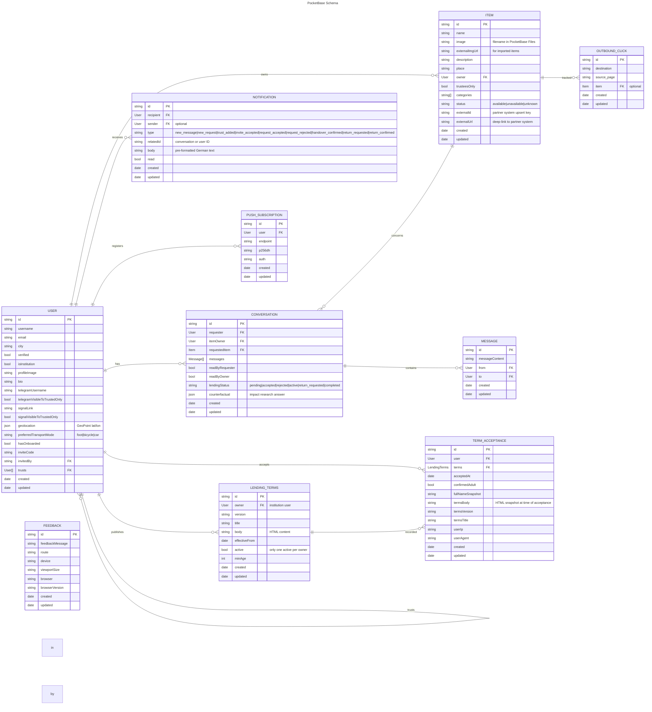

# Data Model

Here live the ER schemas as implemented in the database for the current branch.

# Main Schema

## items_public View

`items_public` is a read-only PocketBase SQL view — not a writeable collection. It joins `items` with `users` to provide trust-filtered, privacy-safe flat rows for the search feature.

**Key privacy guarantee:** raw `geolocation` coordinates are never included. The view exposes only `ownerHasLocation` (0 or 1), computed via a SQL expression. Travel times are calculated server-side via OpenRouteService and surfaced to the client without exposing coordinates.

| Field | Source | Notes |
|---|---|---|
| id, name, image, externalImgUrl, externalUrl, description, trusteesOnly, status, categories, updated | items | Direct columns |
| userId, username, trusts, isInstitution, bio, verified, profileImage, userCreated | users | Joined from owner |
| ownerHasLocation | SQL expression | 1 if geolocation ≠ (0,0), else 0 |

## Impact Research: `counterfactual`

`conversations.counterfactual` is populated at loan completion for a random ~33% of loans. It records the borrower's answer to a survey asking what they would have done without the platform (e.g., bought it new, borrowed elsewhere, gone without). This data is used to measure the platform's environmental and social impact.
