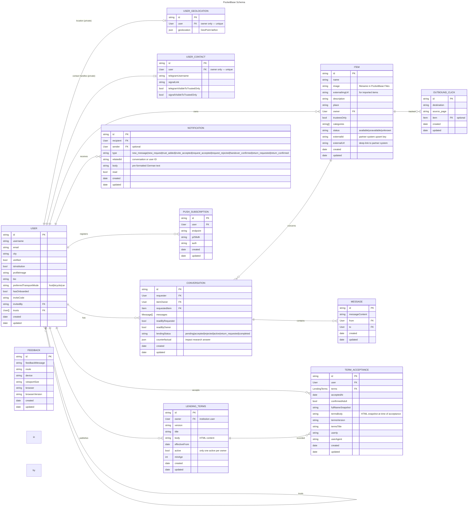

# Data Model

Here live the ER schemas as implemented in the database for the current branch.

# Main Schema

## user_geolocations

Coordinates are **not** stored on `users` — they live in a separate `user_geolocations` collection so they can be locked to the owner. All API rules (`listRule`/`viewRule`/`createRule`/`updateRule`/`deleteRule`) are `@request.auth.id = user`, so a user can only ever read/write **their own** row; no account can query another user's coordinates. The `users` collection no longer has a `geolocation` field at all. Travel-time computation reads coordinates with backend privileges via the `/api/travel-times` hook (see below).

## user_contacts

Messenger handles (`telegramUsername`, `signalLink`) and their per-handle "visible to trusted only" flags live here, **not** on `users`. All API rules are `@request.auth.id = user` (owner-only). They reach other users only through the `GET /api/contact/{userId}` hook, which returns a handle to a caller only if it's public (flag off), the caller is the owner, or the owner trusts the caller — so the "trusted only" toggle is enforced at the data layer, not just in the UI.

## items_public and items_searchable Views

Two read-only PocketBase SQL views expose `items` joined with `users` (and `user_geolocations` for the location flag) as flat, privacy-safe rows. Neither exposes the owner's `trusts` list, and neither includes raw coordinates — they expose only `ownerHasLocation` (0 or 1); travel times are computed in the backend `/api/travel-times` hook, which returns only **bucketed minutes** so coordinates never reach the client.

### `items_public` — public, content-masked

Fully public (`listRule`/`viewRule` are open). For **trustees-only** items the content columns (`name`, `image`, `externalImgUrl`, `externalUrl`, `description`) are masked to `NULL`; only metadata (`categories`, `status`, owner, `trusteesOnly`) stays visible — so the *existence* of a trustees-only item can be shown without leaking its details. The profile and item-detail pages read from this view and, for the owner and trusted viewers, fetch the unmasked details from the base `items` collection (trust rule below).

### `items_searchable` — trust-filtered, unmasked

Used by the search page. Its row-level rule
`trusteesOnly = false || (@request.auth.id != "" && (@request.auth.id = userId || userId.trusts.id ?= @request.auth.id))`
returns public items to everyone, and trustees-only items only to the owner and to users the owner trusts. Content is **not** masked here, because rows a viewer may not see are filtered out entirely. The owner's `trusts` list is only traversed inside the rule, never returned as a column.

| Field | Source | Notes |
|---|---|---|
| id, name, image, externalImgUrl, externalUrl, description, trusteesOnly, status, categories, updated | items | Direct columns (masked to `NULL` for trustees-only items in `items_public`) |
| userId, username, isInstitution, bio, verified, profileImage, userCreated | users | Joined from owner (`trusts` is **not** exposed) |
| ownerHasLocation | SQL expression on `user_geolocations` | 1 if the owner has a non-(0,0) location, else 0 |

> **A view returns only the columns in its `viewQuery` SELECT — nothing else.** The TS
> `ItemPublic` type extends `PocketBaseEntity`, so it *declares* `id`, `created` and `updated`,
> but only the columns above are actually populated. When you need a new column, update the `viewQuery` in `allerleih-backend`
> first; see that repo's README ("Writing migrations").

### Base `items` trust rule

The base `items` collection's `listRule`/`viewRule` are
`@request.auth.id != "" && (trusteesOnly = false || @request.auth.id = owner || owner.trusts.id ?= @request.auth.id)`,
so a trustees-only item's full record is readable only by the owner and trusted users. The profile and item-detail pages use this to un-mask details for trusted viewers.

## Impact Research: `counterfactual`

`conversations.counterfactual` is populated at loan completion for a random ~33% of loans. It records the borrower's answer to a survey asking what they would have done without the platform (e.g., bought it new, borrowed elsewhere, gone without). This data is used to measure the platform's environmental and social impact.
