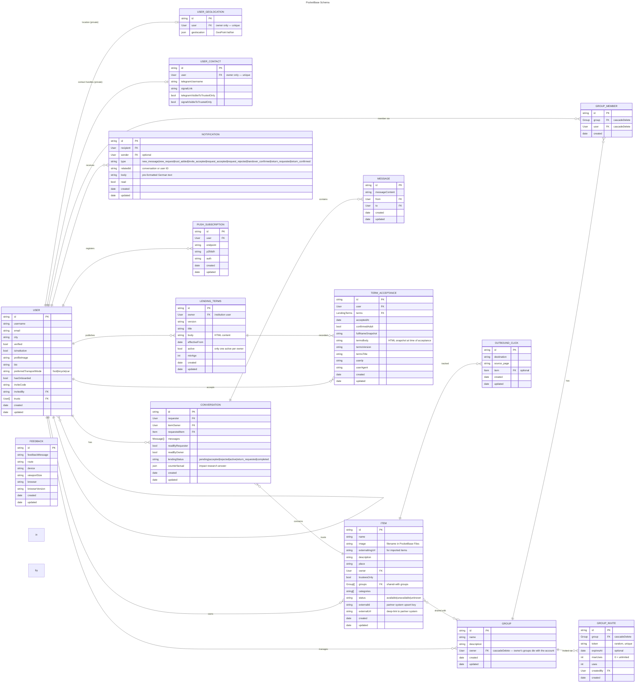

# Data Model

Here live the ER schemas as implemented in the database for the current branch.

# Main Schema

## user_geolocations

Coordinates are **not** stored on `users` — they live in a separate `user_geolocations` collection so they can be locked to the owner. All API rules (`listRule`/`viewRule`/`createRule`/`updateRule`/`deleteRule`) are `@request.auth.id = user`, so a user can only ever read/write **their own** row; no account can query another user's coordinates. The `users` collection no longer has a `geolocation` field at all. Travel-time computation reads coordinates with backend privileges via the `/api/travel-times` hook (see below).

## user_contacts

Messenger handles (`telegramUsername`, `signalLink`) and their per-handle "visible to trusted only" flags live here, **not** on `users`. All API rules are `@request.auth.id = user` (owner-only). They reach other users only through the `GET /api/contact/{userId}` hook, which returns a handle to a caller only if it's public (flag off), the caller is the owner, or the owner trusts the caller — so the "trusted only" toggle is enforced at the data layer, not just in the UI.

## items_public and items_searchable Views

Two read-only PocketBase SQL views expose `items` joined with `users` (and `user_geolocations` for the location flag) as flat, privacy-safe rows. Neither exposes the owner's `trusts` list, and neither includes raw coordinates — they expose only `ownerHasLocation` (0 or 1); travel times are computed in the backend `/api/travel-times` hook, which returns only **bucketed minutes** so coordinates never reach the client.

### `items_public` — public, content-masked

Fully public (`listRule`/`viewRule` are open). For any **restricted** item — i.e.
`trusteesOnly = true` **or** the item is shared with at least one group — the
content columns (`name`, `image`, `externalImgUrl`, `externalUrl`, `description`)
are masked to `NULL`; only metadata (`categories`, `status`, owner, `trusteesOnly`)
stays visible — so the *existence* of a restricted item can be shown without
leaking its details. (Masking on group-shared items is essential: a "group-only"
item has `trusteesOnly = false` yet must not leak publicly.) The profile and
item-detail pages read from this view and, for viewers who may see the item,
fetch the unmasked details from the base `items` collection (rule below).

### `items_searchable` — audience-filtered, unmasked

Used by the search page (and the profile and sitemap, to stay leak-free). Its
row-level rule
`(trusteesOnly = false && groups:length = 0) || (@request.auth.id != "" && (@request.auth.id = userId || (trusteesOnly = true && userId.trusts.id ?= @request.auth.id) || groups.group_members_via_group.user.id ?= @request.auth.id))`
returns public items to everyone, and restricted items only to the owner, the
owner's trustees (when `trusteesOnly`), and members of an attached group. Content
is **not** masked here, because rows a viewer may not see are filtered out
entirely. The `groups` column is excluded from the response (it is only traversed
inside the rule), and the owner's `trusts` list is never returned. Note this view
carries **no** conversation clause (below), so conversation access never leaks an
item into search/profile/sitemap.

| Field | Source | Notes |
|---|---|---|
| id, name, image, externalImgUrl, externalUrl, description, trusteesOnly, status, categories, updated | items | Direct columns (in `items_public` masked to `NULL` for any restricted item — trustees-only **or** group-shared) |
| userId, username, isInstitution, bio, verified, profileImage, userCreated | users | Joined from owner (`trusts` is **not** exposed) |
| ownerHasLocation | SQL expression on `user_geolocations` | 1 if the owner has a non-(0,0) location, else 0 |

### Base `items` rule

The base `items` collection's `listRule`/`viewRule` are
`@request.auth.id != "" && (@request.auth.id = owner || (trusteesOnly = false && groups:length = 0) || (trusteesOnly = true && owner.trusts.id ?= @request.auth.id) || groups.group_members_via_group.user.id ?= @request.auth.id || (@collection.conversations.requestedItem ?= id && @collection.conversations.requester ?= @request.auth.id))`,
so a restricted item's full record is readable by the owner, the owner's trustees
(when `trusteesOnly`), members of an attached group, and the requester of a
conversation about the item. The last clause keeps a borrower's chat working after
they leave the group; because it is **only** on the base collection (not
`items_searchable`), that access stays scoped to the conversation and does not
surface the item in search/profile/sitemap. The profile and item-detail pages use
this rule to un-mask details for viewers who may see the item.

### Groups collections & lifecycle

`groups`, `group_members` and `group_invites` are owner-managed: their rules let
only the group `owner` create/update/delete and list invites/members (a member
can read the group and remove their own membership). Invites are resolved and
consumed through the elevated `GET/POST /api/group-invite/{token}` hooks, so they
are never publicly enumerable. Deleting a group cascades to its memberships and
invites; `items.groups` has `cascadeDelete = false`, so the reference is merely
dropped from the item — and an `onRecordDelete` hook first flips any now-group-less,
non-trustees item to `trusteesOnly = true` so it falls back to **private**, never
public. See [groups.md](groups.md).

## Impact Research: `counterfactual`

`conversations.counterfactual` is populated at loan completion for a random ~33% of loans. It records the borrower's answer to a survey asking what they would have done without the platform (e.g., bought it new, borrowed elsewhere, gone without). This data is used to measure the platform's environmental and social impact.
