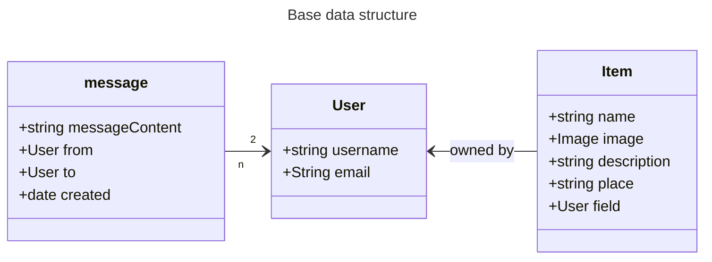

# Overview
This file documents conceptual questions.

# Class diagrams

```mermaid
---
title: Base data structure
---
classDiagram
    direction LR

    class User{
        +string username
        +String email
    }

    class Item{
        +string name
        +Image image
        +string description
        +string place
        +User field <!-- this is currently misnamed, have to adapt in DB and then in code -->
    }
    User <-- Item : owned by

    class message{
        +string messageContent
        +User from
        +User to
        +date created
    }
    message "n" --> "2" User
```