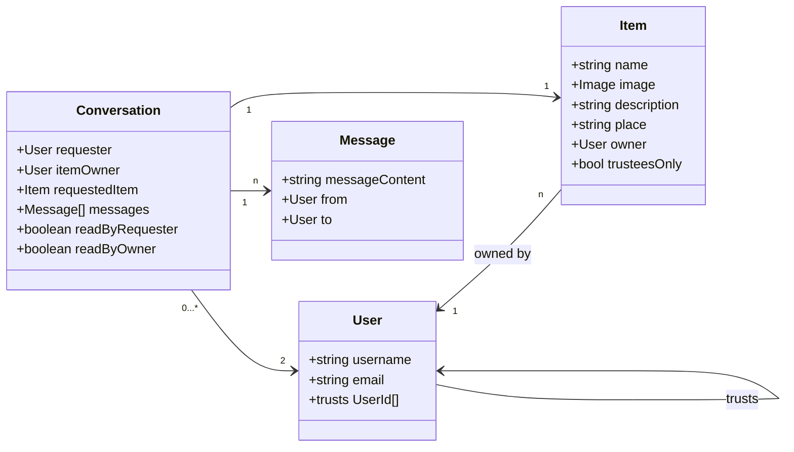

# Domain Model

This file documents conceptual questions.

# Class diagrams

## Base data model

## User entity

- A user can "trust" 0 to n users. Building on this, they can select some of their items to only be visible to their "trustees".

## Item

- "trusteesOnly" is true when the item owner wants to lend this item only to persons they declared as trusted, and otherwise false.

## Conversation

- A conversation brings together an item for which a request has been made, two users (the requester and the owner of the requested item), and a set of messages that were exchanged between the two users regarding that request.
- The conversation stores if it has been read by either party to enable notifications and an "unread" inbox.
