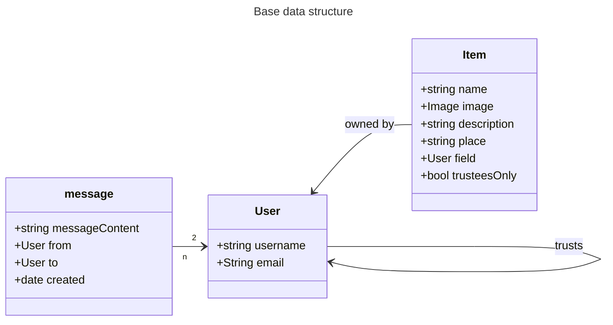

# Overview
This file documents conceptual questions.

# Class diagrams

## User entity
- A user can "trust" 0 to n users. Building on this, they can select some of their items to only be visible to their "trustees". 

## Item
- "trusteesOnly" is true when the item owner wants to lend this item only to persons they declared as trusted, and otherwise false.
