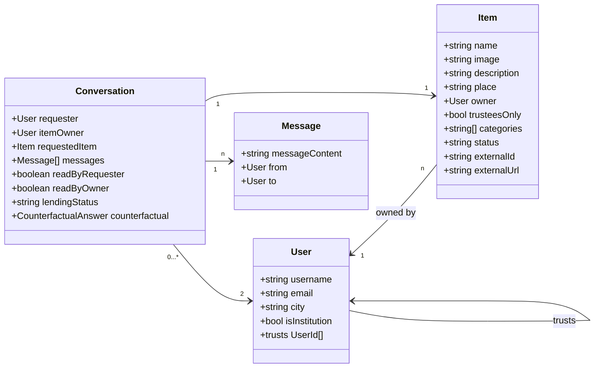
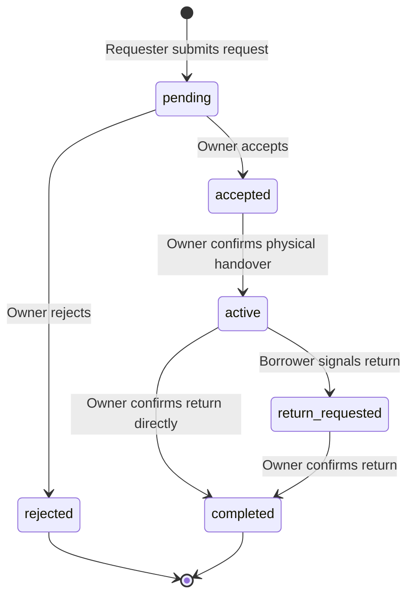

# Domain Model

This file documents conceptual questions about how the AllerLeih domain is modelled.

# Class diagrams

## Base data model

```mermaid

classDiagram
    direction LR

    class User{
        +string username
        +string email
        +string city
        +bool isInstitution
        +trusts UserId[]
    }
    User --> User : trusts

    class Item{
        +string name
        +string image
        +string description
        +string place
        +User owner
        +bool trusteesOnly
        +string[] categories
        +string status
        +string externalId
        +string externalUrl
    }
    User "1" <-- "n" Item : owned by

    class Message{
        +string messageContent
        +User from
        +User to
    }

    class Conversation{
        +User requester
        +User itemOwner
        +Item requestedItem
        +Message[] messages
        +boolean readByRequester
        +boolean readByOwner
        +string lendingStatus
        +CounterfactualAnswer counterfactual
    }
    Conversation "1" --> "n" Message
    Conversation "0...*" --> "2" User
    Conversation "1" --> "1" Item
```

## User entity

- A user can "trust" 0 to n other users. Building on this, they can select some of their items to only be visible to their "trustees".
- **Trust is explicit and 1-hop only.** If A trusts B and B trusts C, A does **not** automatically gain visibility of C's trustees-only items. The trust check is based on the item owner's `trusts` list — there is no transitive or graph-based trust resolution.

## Item

- `trusteesOnly` is `true` when the item owner wants to lend this item only to users they have explicitly trusted; otherwise `false`.
- `status` reflects current availability: `available`, `unavailable` (actively on loan), or `unknown`.
- `categories` is an array of up to 3 values drawn from the fixed `ITEM_CATEGORIES` list in `src/lib/texts.ts`.

## Conversation

- A conversation brings together an item for which a request has been made, two users (the requester and the owner of the requested item), and a set of messages exchanged between them.
- The conversation stores if it has been read by either party to enable notifications and an "unread" inbox.
- `lendingStatus` tracks the lifecycle of the loan (see state machine below).

---

# Lending Workflow State Machine

Every borrow request is modelled as a `Conversation` with a `lendingStatus` field that transitions through the following states:

```mermaid
stateDiagram-v2
    [*] --> pending : Requester submits request
    pending --> accepted : Owner accepts
    pending --> rejected : Owner rejects
    accepted --> active : Owner confirms physical handover
    active --> return_requested : Borrower signals return
    active --> completed : Owner confirms return directly
    return_requested --> completed : Owner confirms return
    rejected --> [*]
    completed --> [*]
```

| Transition | Triggered by | Side effects |
|---|---|---|
| → pending | Requester | Creates `Conversation` record. A request for a `trusteesOnly` item is only allowed if the requester is the owner or is in the owner's `trusts` — enforced by the `conversations` create rule (data layer), not just the UI. |
| pending → accepted | Owner | Sets item `status = unavailable`; auto-rejects all other `pending` conversations for the same item; sends `request_accepted` notification |
| pending → rejected | Owner | Sends `request_rejected` notification |
| accepted → active | Owner | Sends `handover_confirmed` notification |
| active → return_requested | Borrower | Sends `return_requested` notification |
| active or return_requested → completed | Owner | Sets item `status = available`; sends `return_confirmed` notification; ~33% chance triggers counterfactual impact survey |

---

# Institutional Partner Model

Institutions (public libraries, lending shops, tool libraries) are regular `User` accounts with `isInstitution = true` set by an admin in the PocketBase dashboard. This flag enables several additional capabilities:

**Bulk inventory management**
- Unlocks the CSV bulk import UI at `/user/items/bulk-add` and `/user/import`
- `externalId` on items serves as a stable upsert key for re-syncing with partner systems (e.g. WinBIAP)
- `externalImgUrl` is used when no PocketBase image is uploaded (e.g. images hosted in the partner system)

**External item integration**
- Items with `externalUrl` set bypass the AllerLeih request flow entirely — the item detail page shows a CTA that links to the partner's own system instead

**Lending Terms gating**
- Institutions can publish versioned `LendingTerms` records (HTML content + minimum age)
- When active terms exist for an institution, borrowers are redirected to `/items/[id]/terms` and must accept before a conversation can be created
- Acceptance is recorded in `TermAcceptance` with a full snapshot of the terms body, ensuring a legally robust audit trail even when terms are later updated
- When an institution updates their terms, a new `LendingTerms` record is created with `active = true`; the old record remains for historical acceptances
