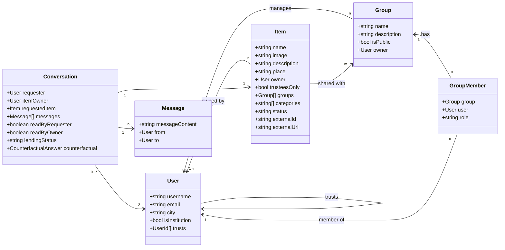
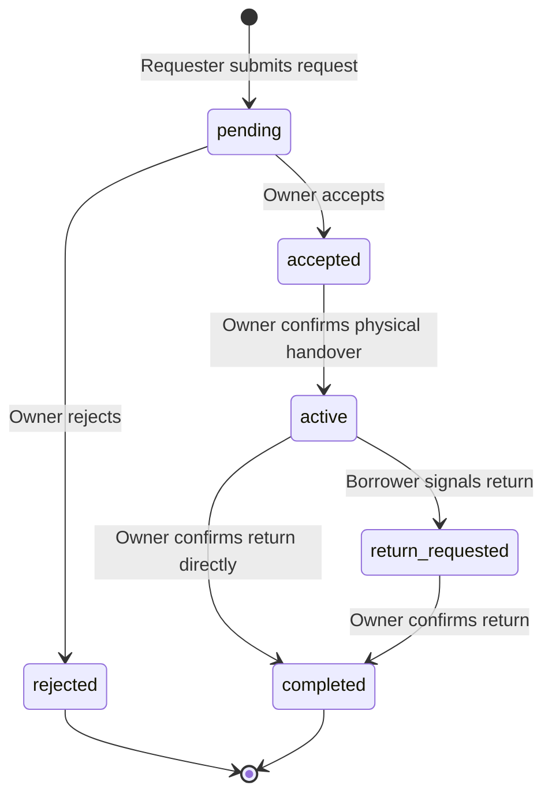

# Domain Model

This file documents conceptual questions about how the AllerLeih domain is modelled.

# Class diagrams

## Base data model

```mermaid

classDiagram
    direction LR

    class User{
        +string username
        +string email
        +string city
        +bool isInstitution
        +UserId[] trusts
    }
    User --> User : trusts

    class Item{
        +string name
        +string image
        +string description
        +string place
        +User owner
        +bool trusteesOnly
        +Group[] groups
        +string[] categories
        +string status
        +string externalId
        +string externalUrl
    }
    User "1" <-- "n" Item : owned by

    class Message{
        +string messageContent
        +User from
        +User to
    }

    class Conversation{
        +User requester
        +User itemOwner
        +Item requestedItem
        +Message[] messages
        +boolean readByRequester
        +boolean readByOwner
        +string lendingStatus
        +CounterfactualAnswer counterfactual
    }
    Conversation "1" --> "n" Message
    Conversation "0...*" --> "2" User
    Conversation "1" --> "1" Item

    class Group{
        +string name
        +string description
        +bool isPublic
        +User owner
    }
    User "1" <-- "n" Group : manages
    class GroupMember{
        +Group group
        +User user
        +string role
    }
    Group "1" <-- "n" GroupMember : has
    User "1" <-- "n" GroupMember : member of
    Item "n" --> "m" Group : shared with
```

## User entity

- A user can "trust" 0 to n other users. Building on this, they can select some of their items to only be visible to their "trustees".
- **Trust is explicit and 1-hop only.** If A trusts B and B trusts C, A does **not** automatically gain visibility of C's trustees-only items. The trust check is based on the item owner's `trusts` list — there is no transitive or graph-based trust resolution.

## Item

- An item has **two independent audience controls**: `trusteesOnly` (visible to
  the owner's trusted contacts) and `groups` (visible to the members of the
  selected groups). An item is **public only when `trusteesOnly = false` AND it is
  shared with no group**; otherwise its audience is the union of whichever
  channels are on. "Group-only" sharing (`trusteesOnly = false` + a group)
  deliberately excludes the general trust list. See [groups.md](groups.md).
- Visibility is enforced at the **data layer**, not just the UI: the public
  `items_public` view masks the content (name/description/images → `NULL`) of any
  *restricted* item (trustees-only **or** group-shared); the base `items`
  collection and the search view `items_searchable` return a restricted item only
  to the owner, the owner's trustees (when `trusteesOnly`), and members of an
  attached group. See [data-model.md](data-model.md).
- `status` reflects current availability: `available`, `unavailable` (actively on loan), or `unknown`.
- `categories` is an array of up to 3 values drawn from the fixed `ITEM_CATEGORIES` list in `src/lib/texts.ts`.

## Groups

- A **group** is a named circle managed by the user who created it (its `owner`);
  any user can create groups. Each membership has a `role` (`admin` | `member`) —
  the owner is an `admin` member, which lays the groundwork for co-admins (the
  promotion UI is future work). A group can be **public** (`isPublic`): world-
  readable and self-joinable without an invite.
- Membership lives in `group_members` (the owner is stored here too, as an `admin`
  row). Members are added by the owner directly, by self-joining a public group, or
  by following a **`group_invites`**
  link (random token, optional expiry and usage cap; joining requires login).
- Groups **extend** the trust model rather than replacing it — an item can be
  shared with trustees, with groups, with both, or neither (public). A trustee who
  is also a group member simply sees the item via the group.
- Lifecycle is handled by cascade + a safeguard hook: deleting a group makes
  group-only items fall back to **private** (never public); deleting an owner's
  account removes their groups, memberships and invites. The **requester** of a
  conversation keeps access to *that conversation's* item even after being removed
  from the group, without the item leaking back into search/profile. See [groups.md](groups.md).

## Conversation

- A conversation brings together an item for which a request has been made, two users (the requester and the owner of the requested item), and a set of messages exchanged between them.
- The conversation stores if it has been read by either party to enable notifications and an "unread" inbox.
- `lendingStatus` tracks the lifecycle of the loan (see state machine below).

---

# Lending Workflow State Machine

Every borrow request is modelled as a `Conversation` with a `lendingStatus` field that transitions through the following states:

```mermaid
stateDiagram-v2
    [*] --> pending : Requester submits request
    pending --> accepted : Owner accepts
    pending --> rejected : Owner rejects
    accepted --> active : Owner confirms physical handover
    active --> return_requested : Borrower signals return
    active --> completed : Owner confirms return directly
    return_requested --> completed : Owner confirms return
    rejected --> [*]
    completed --> [*]
```

| Transition | Triggered by | Side effects |
|---|---|---|
| → pending | Requester | Creates `Conversation` record. A request is only allowed for an item the requester may actually see — public, their own, an item whose owner trusts them, or an item shared with a group they belong to — enforced by the `conversations` create rule (data layer), not just the UI. The owner may **additionally** gate requesting via their `lending_requirements` (e.g. verified e-mail / address), enforced authoritatively by the `conversations` `onRecordCreateRequest` hook (see [data-model.md](data-model.md#lending_requirements)). |
| pending → accepted | Owner | Sets item `status = unavailable`; auto-rejects all other `pending` conversations for the same item; sends `request_accepted` notification |
| pending → rejected | Owner | Sends `request_rejected` notification |
| accepted → active | Owner | Sends `handover_confirmed` notification |
| active → return_requested | Borrower | Sends `return_requested` notification |
| active or return_requested → completed | Owner | Sets item `status = available`; sends `return_confirmed` notification; ~33% chance triggers counterfactual impact survey |

---

# Institutional Partner Model

Institutions (public libraries, lending shops, tool libraries) are regular `User` accounts with `isInstitution = true` set by an admin in the PocketBase dashboard. This flag enables several additional capabilities:

**Bulk inventory management**
- Unlocks the CSV bulk import UI at `/user/items/bulk-add` and `/user/import`
- `externalId` on items serves as a stable upsert key for re-syncing with partner systems (e.g. WinBIAP)
- `externalImgUrl` is used when no PocketBase image is uploaded (e.g. images hosted in the partner system)

**External item integration**
- Items with `externalUrl` set bypass the AllerLeih request flow entirely — the item detail page shows a CTA that links to the partner's own system instead

**Lending Terms gating**
- Institutions can publish versioned `LendingTerms` records (HTML content + minimum age)
- When active terms exist for an institution, borrowers are redirected to `/items/[id]/terms` and must accept before a conversation can be created
- Acceptance is recorded in `TermAcceptance` with a full snapshot of the terms body, ensuring a legally robust audit trail even when terms are later updated
- When an institution updates their terms, a new `LendingTerms` record is created with `active = true`; the old record remains for historical acceptances

**Account deletion & anonymization**
- A user can delete their own account (GDPR Art. 17) from `/user/account`; deletion is refused while a loan is still open (`accepted`/`active`/`return_requested`)
- Deletion is *anonymize-in-place*: the `User` record is kept but its PII is scrubbed and `deleted` is set, so shared `Conversation`/`Message` history and `TermAcceptance` audit records stay referentially intact and render as "Gelöschtes Konto" to the counterparty
- Personal-only data (contacts, geolocation, push subscriptions, owned `Item`s, own notifications) is hard-deleted; the user is removed from every other user's `trusts[]`
- The original email + username are retained in a restricted `deleted_accounts` record for the dispute-resolution window, then purged by a future scheduled job (see [data-model.md](data-model.md))

# Platform Legal Consent (ToS & Privacy)

Distinct from the per-institution `LendingTerms` above, the **platform operator's** Terms of Service and privacy statement are versioned centrally (Issue #399):

- The document text + current version of each document live in the **`legal_documents` collection** (`docType`, `version`, `title`, `effectiveDate`, `body`, `active`), editable by an operator in the PocketBase admin — not hard-coded, so AllerLeih stays self-hostable. The `/misc/tos` and `/misc/privacy` pages render the active row's body, and the same body is snapshotted on consent.
- Each user record caches the latest accepted version per document (`tosAcceptedVersion`, `privacyAcceptedVersion`). On every request, the consent gate in `hooks.server.ts` compares these against the active versions (read from `legal_documents`, cached in-process ~60s) — a mismatch redirects the user to `/legal/accept`. New registrations are stamped with the active versions server-side.
- Every decision (accept or decline) is written to the immutable `user_legal_acceptances` audit collection with a body snapshot, version, timestamp, IP and user-agent. The state is **server-authoritative**: the version cache + `legalLocked` are excluded from the user's `updateRule`, and the audit collection's `createRule = null`, so the consent gate cannot be bypassed and the trail cannot be forged. All writes go through the `legal.pb.js` hooks (`POST /api/legal/accept` / `/api/legal/decline`, superuser, transactional), which snapshot the body from the active `legal_documents` row.
- Declining sets `legalLocked = true`; a locked user is redirected to `/legal/locked`, and the backend additionally **rejects their record mutations at the data layer** (a valid token alone can't bypass the lock via the API). Account data is retained, not deleted.
- A locked user can **self-recover**: the locked page links to `/legal/accept`, and accepting the current terms there records a fresh acceptance and clears the lock in the same transaction — no operator contact required. An admin can also clear `legalLocked` in the PocketBase dashboard.
