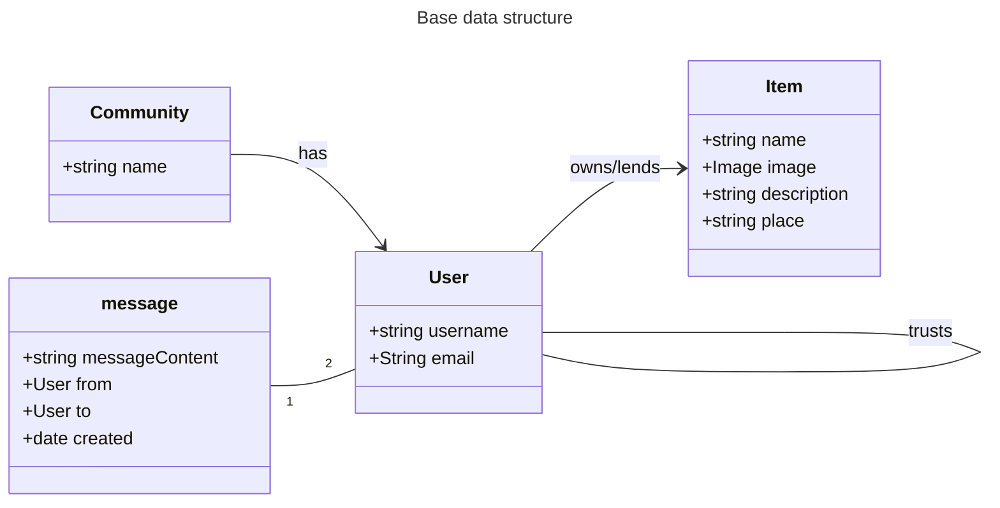
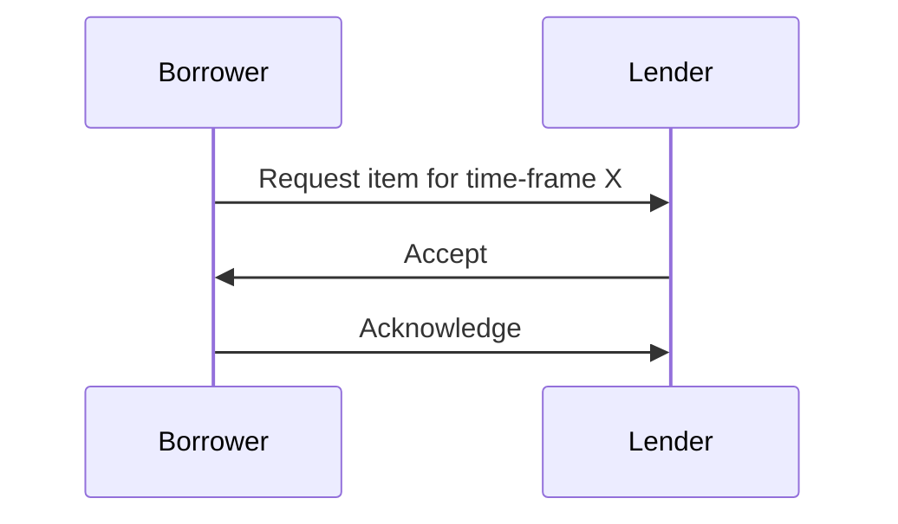
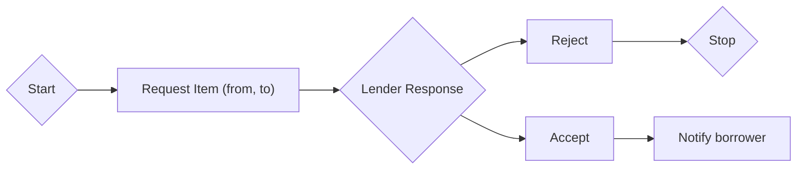

# Intro
This file documents conceptual questions, diagrams are written in [Mermaid](https://mermaid.js.org/).

# Class diagrams

# Sequence diagrams
These hold all sequenced logic
## Borrowing request

# Flow charts
