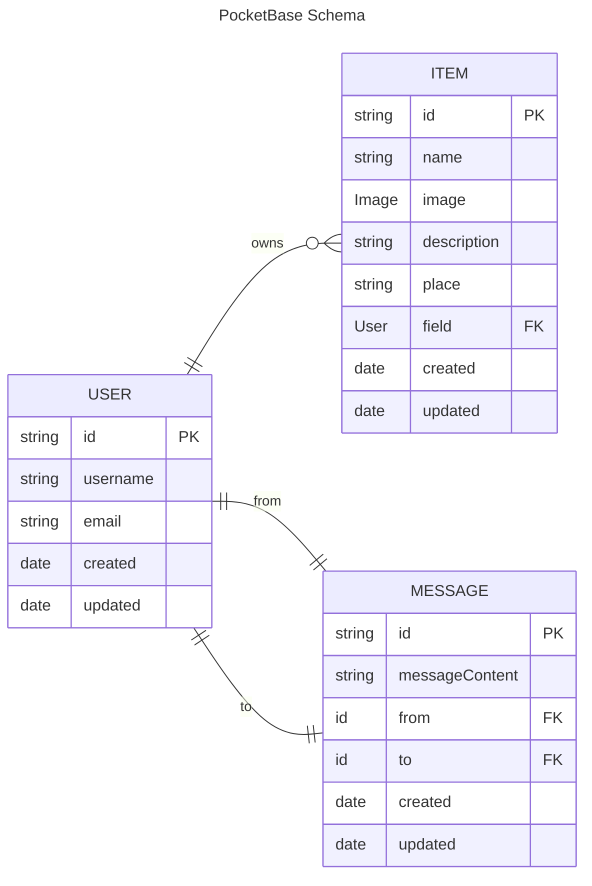

# Database schemas
Here live the ER schemas as (should be) implemented in the database version of the current branch. They are documented as Mermaid.js files (see [ER Syntax](https://mermaid.js.org/syntax/entityRelationshipDiagram.html#syntax) for documentation).

